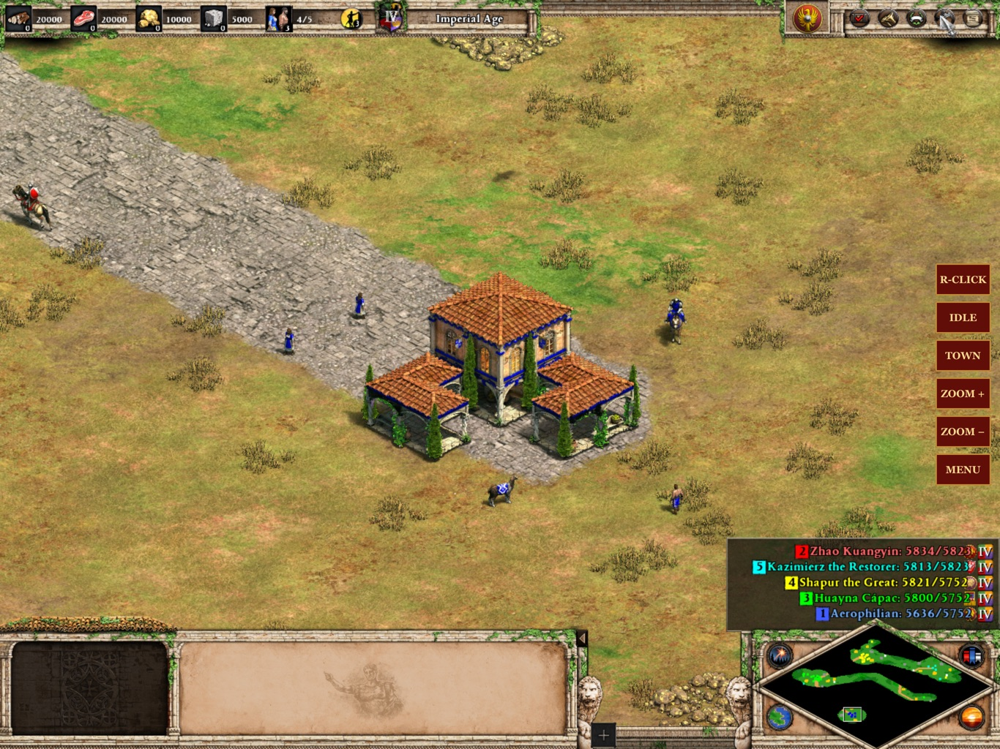

# AgePad

  <strong>Age of Empires II: Definitive Edition, native on iPad.</strong> 
  Your own Steam copy of the Mac game running on the iPad itself, with touch, Apple Pencil, mouse and keyboard controls and Steam signed in on the iPad. No streaming and no computer at play time, online or offline.

AgePad runs the Mac edition of Age of Empires II: Definitive Edition (developed by
Forgotten Empires and World's Edge, published by Xbox Game Studios, Mac port by
Feral Interactive) on iPadOS. It supplies the iPad compatibility layer, touch and
Pencil controls, an in-app Steam sign-in built on Valve's own Steam client, game-data
management and packaging. The game itself and Steam come from your own installs.

  
  
  
  
  
  
  
  
  
  

> [!IMPORTANT]
> **Bring your own game.** AgePad needs Age of Empires II: Definitive Edition from
> Steam (the Mac version comes with the Steam purchase). Releases contain only
> AgePad's own code: no game program, game data, Steam software or saves. You
> assemble your app on your Mac from your own copy.
>
> **Developer preview.** Tested on one iPad (iPad Pro 12.9-inch, M2, 8 GB): menu in
> about 30 seconds, skirmishes at about 120 fps, save and load, Steam online, and
> offline play through Steam's offline mode. Full online matches, long sessions,
> mice and other iPads are not yet verified. Unofficial fan project, not affiliated
> with Microsoft, Valve, Feral Interactive or Apple.
>
> **AI disclosure:** AgePad uses substantial AI assistance for code, tests,
> documentation, debugging and maintenance. There is no audited percentage of
> AI-generated code. Build, test and device records describe what was checked.

## Downloads

| Platform | Download | Setup |
| --- | --- | --- |
| iPad, 8 GB+ | AgePad 0.1 preview · `AgePad-base.ipa` (release not yet published) | [Install from the release](#install-from-the-release) |
| iPad, build it yourself | This repository | [Setup guide](docs/IPAD-SETUP.md) (Xcode, Apple Developer account; paid recommended) |

The release is about 1 MB because it holds only AgePad's own code. A Mac command adds
your own game and Steam files to it in a few seconds; you then install the result
with your usual sideloading tool. [How the release works](docs/IPA-ROUTE.md).

**Update in place.** Reinstalling over an existing AgePad keeps your game files,
saves and Steam sign-in. Deleting the app removes all of them, including the 20 GB of
game data.

### Install from the release

1. On a Mac with the game installed through Steam, download this repository and `AgePad-base.ipa`. The next step uses Python 3; if your Mac doesn't have it yet, macOS offers to install it (Command Line Tools) the first time.
2. Run `scripts/agepad-ipad.sh inject ~/Downloads/AgePad-base.ipa`. It checks your game and Steam versions and writes `generated/AgePad-mine.ipa`. That file contains your copy of the game program; keep it to yourself.
3. Install `AgePad-mine.ipa` with Sideloadly or AltStore (fine for short matches). For full matches with a paid developer account, set up the memory limit once ([Setup guide, Step 1](docs/IPAD-SETUP.md#step-1--signing-with-the-larger-memory-limit-once)) and install with `scripts/sign-agepad-ipa.sh generated/AgePad-mine.ipa <iPad ID> [your app ID]`.
4. Connect the iPad, open it in **Finder → Files**, and drag the `AgeOfEmpires2Data` folder (Steam → Age of Empires II: DE → Manage → Browse local files) onto **AgePad**. About 20 GB; keep 25 GB free.
5. Open AgePad and sign in to Steam once by scanning the code with the Steam app on your phone. From then on, tap the icon to play.

## Playing

**Need help or found a bug?** Ask in the [Discord](https://discord.gg/xwHfUD2bxW) or
[open an issue](../../issues). `scripts/agepad-ipad.sh logs` copies the iPad's logs to
your Mac (it needs Xcode and `brew install libimobiledevice`; set `AGEPAD_BUNDLE_ID` if
your app ID isn't the default); please don't attach game files, saves or Steam details.

[Frequently asked questions](#frequently-asked-questions) · [Setup guide and full controls](docs/IPAD-SETUP.md) · [Release route and limits](docs/IPA-ROUTE.md)

- **Touch:** tap to select, two-finger tap for orders (right click), two- or
  three-finger drag to move the map, pinch to zoom. Side buttons: R-CLICK, IDLE villager, TOWN
  center, ZOOM and MENU.
- **Apple Pencil:** tap a unit, then each Pencil tap on the map is an order; hold for
  half a second, double-tap the Pencil, or squeeze an Apple Pencil Pro to stop.
- **Mouse, trackpad and keyboard:** clicks, right clicks, drag-select, the wheel
  (zoom) and the game's own hotkeys.
- **Online and offline:** online everything runs through Steam as on a computer.
  Without Internet AgePad uses Steam's offline mode (single player, skirmish and
  campaigns). Open AgePad once with Internet before you go offline.
- **HUD size** starts at 125% on a new install; change it in the game's
  Options → Interface. **Signing out:** iPad Settings → AgePad → *Sign out of Steam*.

Checked on the tested iPad: touch, Apple Pencil, keyboard and trackpad, save/load,
Steam sign-in, going online, and offline play. Map dragging with three fingers was
reworked on 30 September (iPadOS no longer takes three-finger swipes for undo, and
a drag no longer turns into a zoom halfway); its gesture logic is covered by
Simulator tests in `scripts/run-de-tests.sh`. A mouse, full online matches, sessions
over an hour and other iPad models are not yet verified.

## Frequently asked questions

Can I download a ready-to-play IPA?

No. A complete app would contain Microsoft's game program and Valve's Steam software, which aren't ours to distribute, and iPadOS only runs code signed into the app. The release is AgePad's own code plus a list of which of your files go where; `inject` assembles your app from your own copy. The release is audited to contain no game or Steam files.

Which iPads work?

iPads with 8 GB of memory or more, for example iPad Pro with M1, M2 or M4, or iPad Air with M2 or later. Only an iPad Pro 12.9-inch (M2) has been tested. iPhones and 4–6 GB iPads can't hold a match.

Do I need a paid Apple Developer account?

It's recommended. With a paid account (99 USD a year) the app gets Apple's larger memory limit (8 GB on the tested iPad) and lasts a year between installs. A free Apple ID gives about 5 GB: a five-player match loads and plays, but with little spare memory, so long matches may be closed by iPadOS; free installs also expire after 7 days. See [memory](docs/IPA-ROUTE.md#memory-the-one-real-limit).

How does Steam work on the iPad? Is my password stored?

AgePad runs Valve's own Steam client engine, taken from your Mac's Steam, inside the app. You sign in once by scanning a QR code with the Steam phone app (or with your password and Steam Guard). AgePad keeps Steam's sign-in token in the iPad Keychain and never stores or logs your password. Steam itself decides whether your account owns the game. The iPad appears in your account as "AgePad (iPad)".

Can I play offline, for example on a flight?

Yes, through Steam's own offline mode: single player, skirmish and campaigns. It needs an earlier online sign-in on the iPad; open AgePad once with Internet before you go. Tested with Internet blocked; a real airplane-mode flight hasn't been tried.

What happens when the game or Steam updates?

The iPad keeps the game version it has and tells you when Steam has a newer one. Single player and offline play are unaffected; online matches need the current version, which needs a matching AgePad release first. An installed AgePad keeps working when Steam for Mac updates. Each release matches one game and one Steam version, so `inject` refuses newer files until a matching release is out (building it yourself picks up the new Steam at once). If Valve ever stops accepting AgePad's copy of Steam, the iPad says so and still starts offline.

How much storage does AgePad use?

About 20 GB of game data plus about 180 MB for the app. Keep 25 GB free for the first copy.

Does this repository include Age of Empires II?

No. There is no game program, game data, Steam software or saves here. Don't request or attach game files in issues.

## Build and contribute

[Setup guide](docs/IPAD-SETUP.md) · [Release route](docs/IPA-ROUTE.md) · [Steam engine log](docs/STEAM-ENGINE-LOOP.md) · [Building from scratch](docs/DE-BOOTSTRAP-20260919.md) · [Engineering history](docs/ENGINEERING-HISTORY.md)

`scripts/agepad-ipad.sh check` lists what's ready and what's missing; `setup` builds,
signs and installs in place and copies the game files over USB-C; `sync` copies only
what a game update changed; `kit` makes the release base app and audits it.
Contributions are welcome through issues and pull requests; please keep game and
Steam files out of them.

## Credits and license

Age of Empires II: Definitive Edition is developed by Forgotten Empires and World's
Edge and published by Xbox Game Studios; the Mac version is by Feral Interactive.
Steam is Valve's. AgePad is an independent fan project and is not affiliated with or
endorsed by any of them.

AgePad's own code is released under the [MIT License](LICENSE). Game and Steam files
are not included in this repository and are not covered by it. Third-party code and
patches keep their own licenses: [THIRD_PARTY_NOTICES.md](THIRD_PARTY_NOTICES.md).
