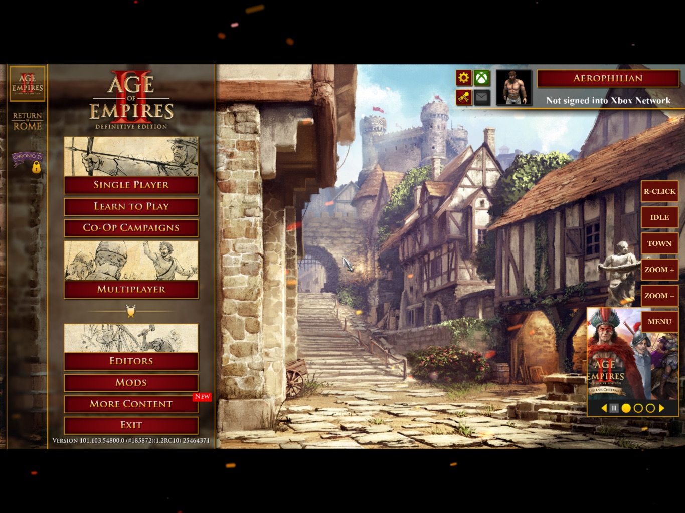

# Playing AgePad on your iPad

AgePad runs your own copy of **Age of Empires II: Definitive Edition** (the Steam Mac version) natively on an iPad. It is the original game, not a stream or a remake. This guide covers what you need and what happens at each step.

**Current status (26 September 2026):** engineering preview. On an iPad Pro 12.9-inch (M2, 8 GB) the game signs in to Steam on the iPad itself, reaches the menu with no Mac, starts in Steam's offline mode without Internet, plays audio, loads a skirmish, and accepts touch and Apple Pencil. A real flight, save/resume, online matches and long sessions are still being tested. There is no App Store or public download: you build it yourself from your own Steam copy (below).

## How it works

| Part | Where it runs | What it does |
|---|---|---|
| The game (original Mac executable + your game files) | iPad | Runs the game natively on the iPad's Apple silicon |
| AgePad compatibility layer | iPad | Translates the Mac windowing, graphics, audio and input calls to iPadOS |
| Steam | **iPad** (new, in testing) or your Mac | Proves you own the game, exactly as when you play on the Mac |
| `scripts/agepad-ipad.sh play` / Mac helper | Your Mac | Fallback: forwards the game's Steam requests to the Mac's Steam over the cable, Wi-Fi or Tailscale |

**About Steam (26 September, in testing).** AgePad now carries Valve's own Steam client engine — the same `steamclient.dylib` that runs inside Steam on your Mac, copied from your own Mac Steam install when the app is built — and runs it on the iPad. The first time you open AgePad it shows **Sign in to Steam** with a QR code: open the Steam app on your phone, tap the Steam Guard shield and scan it (or tap *Sign in with your password instead*; a Steam Guard code is asked for if Steam wants one). You do this once. AgePad keeps the resulting sign-in in the iPad's Keychain (this device only) and never stores or logs your password; the iPad appears in your Steam account as "AgePad (iPad)". After that, tapping the icon signs in to Steam on the iPad and starts the game, with no Mac involved. With no connection it uses Steam's own offline mode, which, as on a PC, needs one earlier online sign-in on this iPad. Nothing is faked: Steam itself decides whether your account owns the game, and without a sign-in the game quits at startup.

Status (26 September): on the tested iPad the QR sign-in works, the sign-in is remembered, Steam confirms ownership, and tapping the icon reaches the main menu with no Mac (about a minute; intro videos are skipped by default, which is still being timed). With the network blocked, Steam's offline mode starts the game to its main menu (multiplayer greyed out, as on a PC); a real airplane-mode launch, save/resume and online play are being verified. The Mac routes remain available: **Play with my Mac's Steam instead** on the sign-in screen (after pairing, Step 5), or `play` over USB.



## What you need

- A Mac with Apple silicon and Xcode, and Steam for Mac with **Age of Empires II: DE** installed (you must own it; it is the Mac edition of the same Steam purchase).
- Homebrew's USB file library: `brew install libimobiledevice pkgconf`.
- An iPad with **8 GB of memory or more** (tested: iPad Pro 12.9-inch, M2) and about **25 GB free**, with Developer Mode on (Settings → Privacy & Security → Developer Mode; iPadOS asks for it the first time an app from your Mac is installed).
- A USB-C cable between the iPad and the Mac, for setup and for later game updates. Playing needs no cable and no Mac.
- An Apple Developer account signed in to Xcode, to sign AgePad for your own iPad. A paid account is recommended: with a free account the app stops opening after 7 days until you run setup again, and whether a free account can grant the larger memory limit (below) has not been tested.
- A phone with the Steam app, for the one-time sign-in (or your Steam password).

Nothing is downloaded: AgePad is built on your Mac from this repository plus your own Steam install, and your game files go from your Mac to your iPad over the cable. No game files, Steam software or sign-in are ever published with AgePad.

## Step 1 — Signing with the larger memory limit (once)

A loaded skirmish uses about 5.1 GB, right at iPadOS's default per-app limit, so AgePad requests Apple's **increased memory limit** capability (on the tested iPad the limit rises from 5.1 GB to 8 GB). Xcode creates the matching provisioning profile once:

1. Open Xcode → Settings → Accounts, and make sure your team is listed. Connect the iPad once so Xcode registers it.
2. Let Xcode register the app ID `local.agepad.device-de-probe` with the *Increased Memory Limit* capability: build any small iOS app target with that bundle ID, automatic signing, and an entitlements file containing `com.apple.developer.kernel.increased-memory-limit = YES`. (That bundle ID belongs to one developer team; on another team pick your own, for example `com.yourname.agepad`, and set `AGEPAD_BUNDLE_ID` to it when you run the commands below.)

AgePad finds the profile and signing certificate itself. `check` says what is missing if it can't.

## Step 2 — Set up

Connect the iPad with the USB-C cable, unlock it, then on the Mac, in this folder:

```
scripts/agepad-ipad.sh setup
```

It checks everything first (✓ or ✗ with how to fix each ✗), then builds AgePad, installs it on the iPad **in place** (saves and game files already there are kept), and copies your game files: about 20 GB and 25,000 files the first time. If the copy is interrupted, run it again and it continues. `scripts/agepad-ipad.sh check` shows the same checks without changing anything.

The first time on a new Mac, the build needs a one-time **build package** made from your game (`check` says so): `python3 scripts/bootstrap-de-simulator.py generated/de-candidate-YYYYMMDD`, then point `AGEPAD_CANDIDATE` at it; see [DE-BOOTSTRAP-20260919.md](DE-BOOTSTRAP-20260919.md). It uses the iPad Simulator in Xcode for two survey steps (which Apple functions exist on iOS). On 26 September a from-scratch package reached the main menu on the tested iPad; the two survey results were reused from an earlier run (`--survey`, `--client-survey`) because other work had the Simulator busy.

## Step 3 — Sign in to Steam and play

Open AgePad on the iPad. The first time, it shows **Sign in to Steam** with a QR code: in the Steam app on your phone tap the Steam Guard shield and scan it (or use *Sign in with your password instead*). After that, tapping AgePad signs in by itself and opens the game in about half a minute to a minute.

- **Online:** everything works, including multiplayer (a real online match is still being tested).
- **Offline, e.g. on a flight:** AgePad uses Steam's own offline mode. Single player, skirmish and campaigns work; multiplayer is greyed out. Open AgePad once with Internet before you go offline.
- **Signing out or switching accounts:** iPad Settings → AgePad → *Sign out of Steam*; it applies the next time you open AgePad. To also remove the iPad from your Steam account, revoke "AgePad (iPad)" in Steam's security settings.

## Keeping it up to date

- **When Steam updates itself on your Mac,** run `scripts/agepad-ipad.sh setup` (or `build`) with the iPad connected. AgePad takes Valve's Steam software from your Mac each time it is built. If Valve's servers ever stop accepting the copy inside AgePad, the iPad says so, tells you to do this, and keeps working offline in the meantime.
- **When Steam updates Age of Empires II,** AgePad says so on the iPad the next time it opens with Internet (it reads the current version from Steam's own data). The iPad keeps the version it has. That is fine for single player and offline play, but online matches need the current version. AgePad itself must first be updated for each new game version (its program is matched to one game version). `check` and `sync` tell you when that is the case and refuse to copy mismatched files. Once AgePad supports the new version, `sync` copies only the files the update changed.
- `scripts/agepad-ipad.sh logs` copies the iPad's logs to `generated/ipad-logs/` for a bug report.

## Other ways to play

The Mac routes remain as fallbacks: **Play with my Mac's Steam instead** on the sign-in screen (after `scripts/agepad-ipad.sh pair` and `install-helper`), or the engineering `scripts/agepad-ipad.sh play` over USB, which needs Steam open on the Mac for the whole session.

In menus, taps are always plain clicks.

**HUD size:** AgePad starts the in-game HUD at 125% on a new installation (it reads small on an iPad at the game's 100%). Change it any time in the game's **Options → Interface → HUD scale**; AgePad never changes it again. A new installation also skips Feral's desktop pre-game launcher and its Mac mouse tips, with crash reports and usage statistics off (changeable in the game's options).

**Steam:** the name at the top right of the main menu is your Steam account.
## Controls in a match

| Gesture | Action |
|---|---|
| Tap | Select (left click) |
| Drag | Selection box |
| Two-finger tap | Right click: move, gather, attack |
| Three-finger drag | Move the map: drag a little in any direction and the view keeps scrolling that way (at the game's scroll speed) until you lift |
| Pinch | Zoom |
| Apple Pencil tap on a unit or drag-box | Select; the next Pencil taps on the map give orders (right click) until you… |
| Apple Pencil hold (½ s) | …plain left click, which stops giving orders |
| Apple Pencil double-tap (2nd gen / Pro) or squeeze (Pro) | Deselect and stop giving orders |
| Pencil tap on the top bar or bottom panel | Normal button press |
| A mouse or trackpad (Bluetooth or USB-C) | Click, right click (secondary button or two-finger click), drag-box select. The wheel or a two-finger trackpad scroll zooms, as on the Mac (added 26 Sep, not yet tried with a real mouse); move the map with the keyboard arrows or the minimap |
| A hardware keyboard | All the game's own hotkeys (F10 menu, Enter chat, letter shortcuts) |

Side buttons:

| Button | Action |
|---|---|
| R-CLICK | The next tap is a right click (useful with one finger). Shows CANCEL while waiting |
| IDLE | Next idle villager |
| TOWN | Town Center; tap again to cycle through your Town Centers |
| ZOOM + / ZOOM − | Zoom; hold to keep zooming |
| MENU | Opens the game menu; tap again to close it |

In menus, taps are always plain clicks.

**Tip:** the in-game HUD looks small on the iPad. In the game's **Options → Interface**, raise **HUD scale** and confirm; the setting is kept in your profile.

**Steam:** the name at the top right of the main menu is your Steam account — signed in on the iPad, or through the Mac when you use a Mac route.

## Known limits

- The iPad-only Steam route is new and still being verified (menu, offline mode, online play). The Mac routes keep working as a fallback.
- Loading a skirmish takes about a minute. The first launch after install is slower.
- Save, relaunch and resume work on the iPad (also offline); a match holds about 120 fps at about 4.6–4.8 GB. Online matches have not been played end to end.
- iPads with less than 8 GB of memory are not expected to fit a match; iPhones are out of scope for the same reason.
- The player score list can overlap the top of the minimap at the default HUD scale; under investigation.
